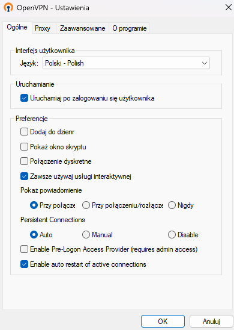

# Konfiguracja tunelu VPN
Najnowsza wersja sprawozdania jest dostępna pod adresem [https://github.com/Gombek7/techniki-poufnosci/blob/main/Konfiguracja tunelu VPN/sprawozdanie.md](https://github.com/Gombek7/techniki-poufnosci/blob/main/Konfiguracja%20tunelu%20VPN/sprawozdanie.md)

Członkowie zespołu:
- Jarosław Dakowicz
- Piotr Kozioł

## Konfiguracja serwera

Rolę serwera będzie pełnił laptop z systemem Windows. OpenVPN zostało zainstalowane za pomocą dostarczonego instalatora msi.

|  | 
|:--:| 
| *GUI programu OpenVPN* |

