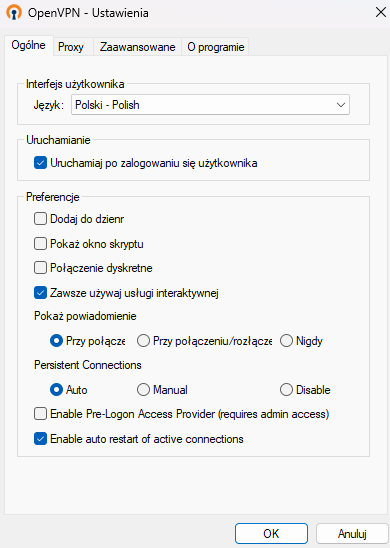
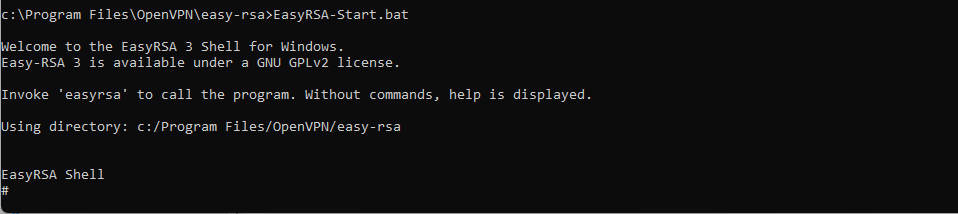
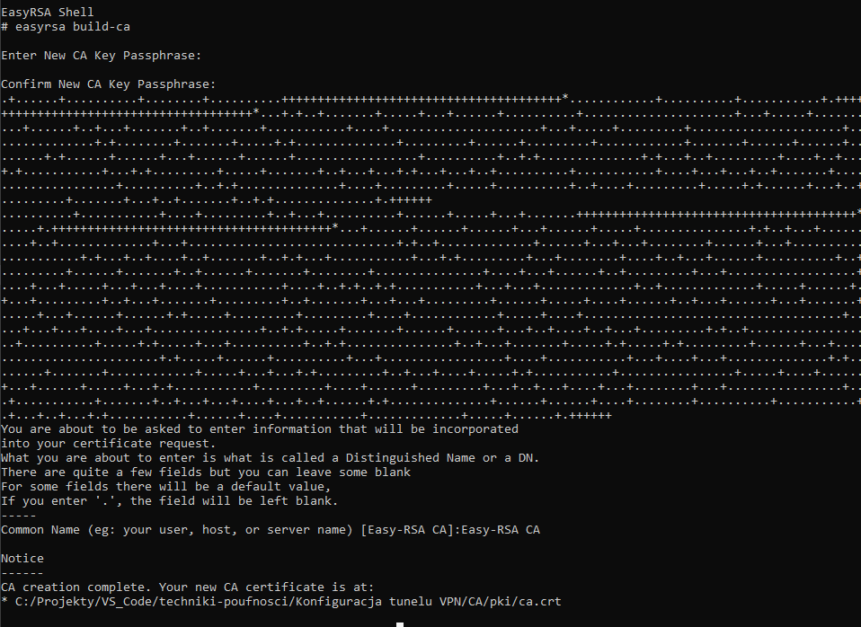
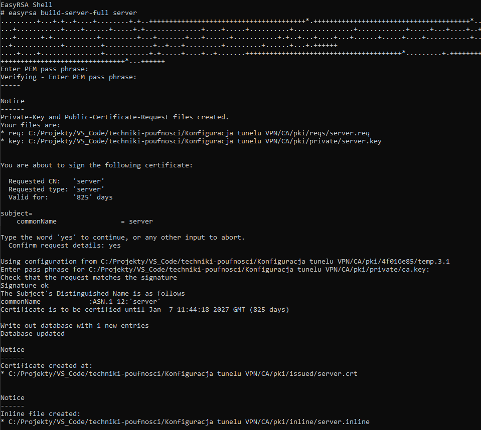
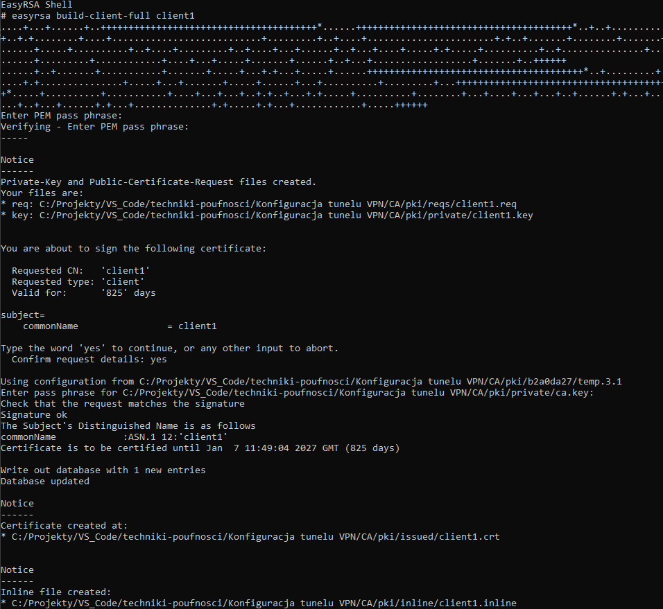
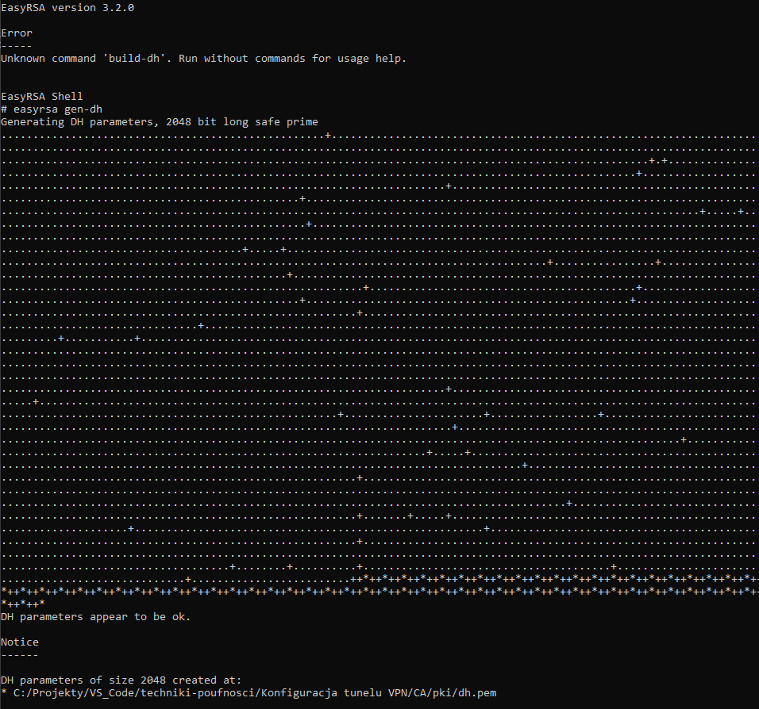

# Konfiguracja tunelu VPN
Najnowsza wersja sprawozdania jest dostępna pod adresem: [https://github.com/Gombek7/techniki-poufnosci/blob/main/Konfiguracja tunelu VPN/sprawozdanie.md](https://github.com/Gombek7/techniki-poufnosci/blob/main/Konfiguracja%20tunelu%20VPN/sprawozdanie.md)

Członkowie zespołu:
- Jarosław Dakowicz
- Piotr Kozioł

## Generowanie certyfikatów

Rolę serwera będzie pełnił laptop z systemem Windows. OpenVPN zostało zainstalowane za pomocą dostarczonego instalatora msi.


|  | 
|:--:| 
| *GUI programu OpenVPN* |


### Generowanie certyfikatu CA

Do zarządzania certyfikatami został użyty zestaw skryptów `easy-rsa 3` zainstalowany wraz z OpenVPN. W systemie Windows należy najpierw uruchomić dostarczoną powłokę.

|  | 
|:--:| 
| *Uruchomienie Powłoki EasyRSA 3* |

Następnie należało zainicjalizować PKI i zbudować CA.

|  | 
|:--:| 
| *Inicjalizacja PKI* |

|  | 
|:--:| 
| *Zbudowanie CA* |

Zastosowany passphrase to `student`.

### Generowanie certyfikatu i klucza dla serwera

|  | 
|:--:| 
| *Zbudowanie certyfikatu i klucza dla serwera* |

Zastosowany passphrase to `student`.

### Generowanie certyfikatu i kluczy dla klienów

Proces generowania certyfikatów i kluczy dla klientów przebiegł podobnie jak dla serwera. Zastosowane passphrase'y to `student`.

|  | 
|:--:| 
| *Zbudowanie certyfikatu i klucza dla pierwszego klienta* |


### Generowanie parametrów DH

|  | 
|:--:| 
| *Wygenerowanie parametrów DH* |

### Podsumowanie wygenerowanych plików

| Plik | Potrzebny przez | Przeznaczenie | Sekret |
| -- | -- | -- | -- |
| ca.crt | serwer + wszyscy klienci | Główny certyfikat CA | NIE |
| ca.key | tylko maszyna podpisująca klucze | Główny klucz CA | TAK |
| dh{n}.pem | tylko serwer | Parametry Diffie'go Hellman'a | NIE |
| server.crt | tylko serwer | Certyfikat Serwera | NIE |
| server.key | tylko serwer | Klucz Serwera | TAK |
| client1.crt | tylko client1 | Certyfikat client1 | NIE |
| client1.key | tylko client1 | Klucz Client1 | TAK |
| client2.crt | tylko client2 | Certyfikat Client2 | NIE |
| client2.key | tylko client2 | Klucz Client2 | TAK |
| client3.crt | tylko client3 | Certyfikat Client3 | NIE |
| client3.key | tylko client3 | Klucz Client3 | TAK |

## Konfiguracja serwera

Aby dodać autoryzację poprzez login i hasło można użyć dyrektywy `auth-user-pass-verify `. Należy wtedy wskazać program lub skrypt, który zajmie się weryfikacją użytkowników. W naszym przypadku użyjemy skryptu `auth.bat`.

Zawartość pliku `server.ovpn` z konfiguracją serwera:
```apacheconf
port 1194
proto udp
dev tun
ca ca.crt
cert server.crt
key server.key  # This file should be kept secret
dh dh.pem
topology subnet
server 10.8.0.0 255.255.255.0
ifconfig-pool-persist ipp.txt
keepalive 10 120
persist-key
persist-tun
status openvpn-status.log
verb 3
explicit-exit-notify 1

#auth
script-security 2
auth-user-pass-verify auth.bat via-file
```

Zawartość pliku `auth.bat`:
```bat
@echo off
SETLOCAL EnableDelayedExpansion

rem Wprowadź użytkowników i hasła poniżej
set users[0]=client1 student1
set users[1]=client2 student2
set users[2]=client3 student3

rem Pobieranie loginu i hasła z pliku podanego jako argument
set /A count=0
for /F "tokens=*" %%A in (%~1) do (
 if !count!==1 (
  set password=%%A
  set /A count=2
 )
 if !count!==0 (
  set username=%%A
  set /A count=1
 )
)

rem Sprawdzanie poprawności loginu i hasła
set matched=0
for /L %%i in (0, 1, 2) do (
  for /F "tokens=1,2" %%u in ("!users[%%i]!") do (
    if "!username!"=="%%u" if "!password!"=="%%v" (
      set matched=1
    )
  )
)

rem Wynik
if !matched!==1 (
  exit 0
) else (
  exit 1
)
```


## Konfiguracja klienta (komputer)

## Konfiguracja klienta (android)